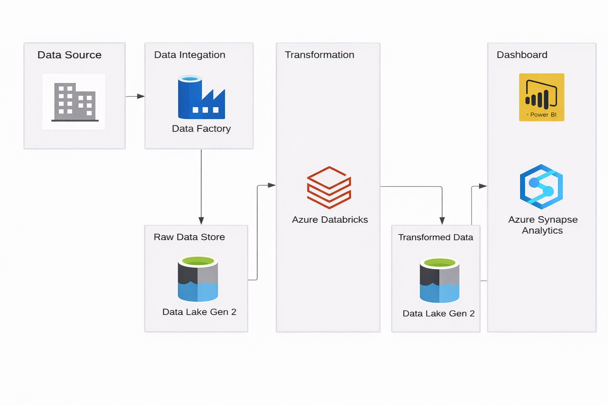

# Olympic_data_engineering_pipeline
## Introduction
This project demonstrates an end-to-end Azure data engineering pipeline for analyzing Tokyo Olympics data. Data is ingested using Azure Data Factory (ADF), stored in Azure Data Lake Gen2, transformed using PySpark in Azure Databricks, analyzed with Azure Synapse Analytics, and visualized through Power BI dashboards. 
## Architecture

## Technologies Used
1. Microsoft Azure
   - Azure Data Factory
   - Synapse Analyitcs
   - Azure blob Storage
2. Dashboard - Power BI
3. Pyspark

## Dataset Used
The  dataset includes athletes data with columns athlete_id, name, country, discipline, events data with event_id, event_name, sport, event_date, and medals data with country, gold, silver, bronze, and total.
##  Transformations & Scripting 
1. [Data_Transormations](Transformation.ipynb)
2. [Sql_quires](Sql_query.sql)
